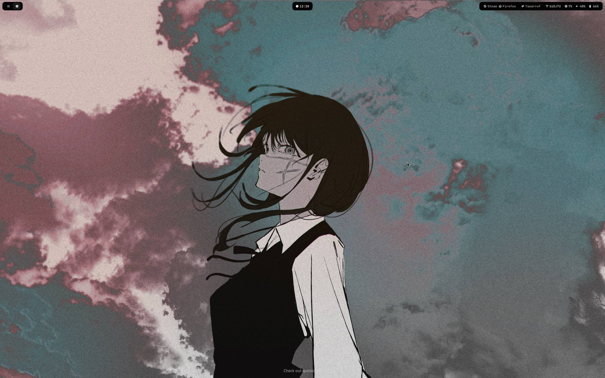
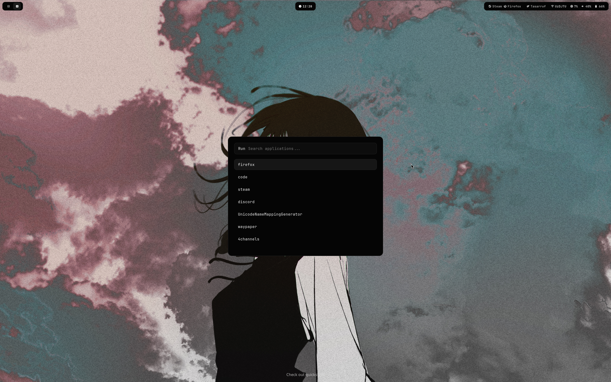
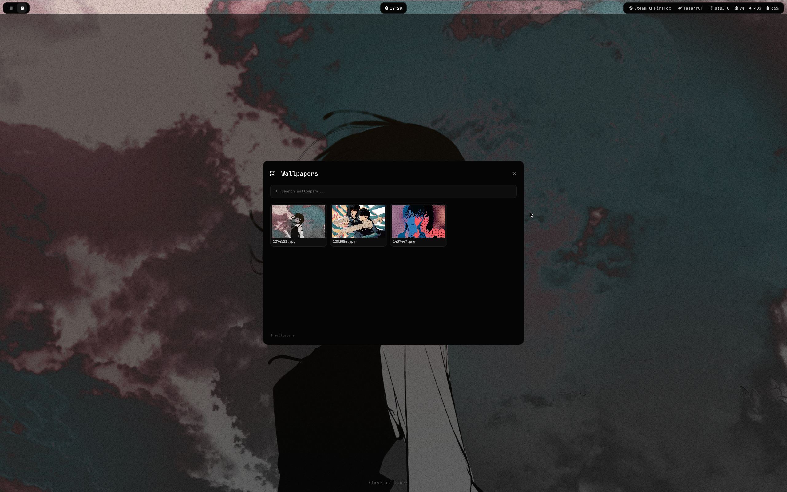
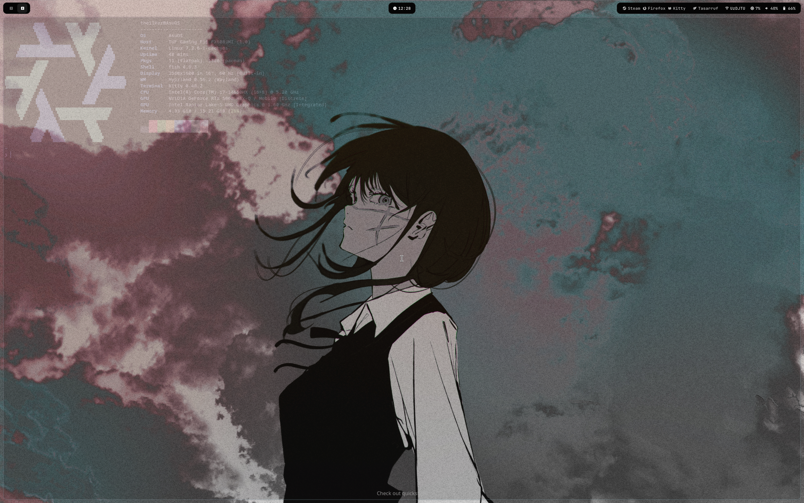
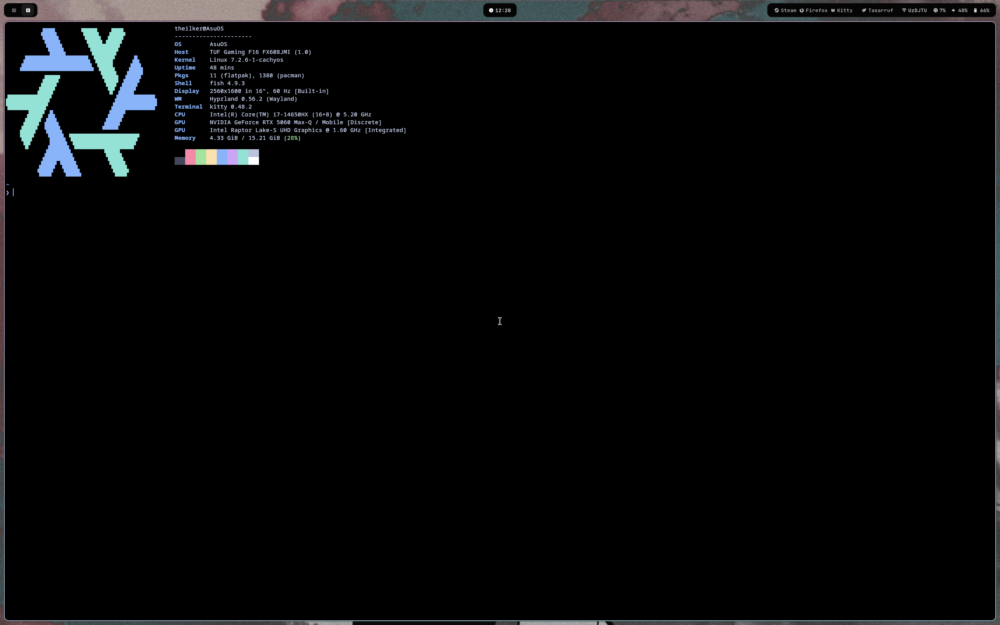

# My Hyprland Rice

A minimal, dark-themed Hyprland rice for Arch/CachyOS.

Built around a clean black aesthetic with subtle borders, rounded corners, and a monochrome color palette.

### Components

* **WM:** Hyprland
* **Bar:** Waybar
* **Notifications:** Dunst
* **Terminal:** Kitty
* **Launcher:** Rofi
* **File Manager:** Dolphin
* **Wallpaper:** Wally Paper
* **System Info:** Fastfetch

### Theme

The setup uses a mostly black interface with `#050505` backgrounds, `#1c1c1c` borders, and white/gray text for a clean and minimal look.

### Features

* Minimal Waybar
* Power profile switcher
* Dunst notifications
* Wallpaper picker
* Screenshot shortcuts
* Custom Fastfetch configuration
* NVIDIA GPU setup
* Designed for a distraction-free desktop

> Built for personal use and continuously evolving.

